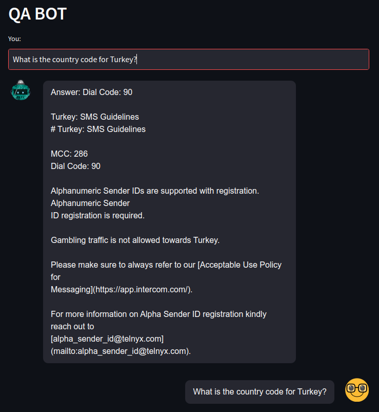

# Question Answering From Documents using LangChain, Cohere, ChromaDB and Streamlit

This bot uses your documents to anwser questions.

</br>



</br>

<p>Streamlit is used for frontend</p>
<p>The documents are stored in the ChromaDB vector database using Cohere Embeddings.</p>
<p>Similarity search is done over the vector database to fetch only the top 5 relevant documents to the question and supplied to the Cohere LLM with a custom prompt.</p>

## Getting Started

```console
# Get the repository to your local folder
git clone https://github.com/HasanResul/question-answering-bot.git

# Create a virtual environment
python -m venv env

# Activate the environment
# On Windows
env\Scripts\activate.bat
# On Unix or MacOS
source env/bin/activate

# Update pip
python -m pip install --upgrade pip

# Install the required packages
pip install langchain chromadb cohere html2text streamlit streamlit-chat

# You need to add your api key for CohereEmbeddings into the `.env` file 

# Run the bot
streamlit run main.py
```

### Challenges

1. Some questions cannot be answered correctly.
&nbsp;<p>The main reason for this, I believe, with the retriever.
&nbsp;<p>When `retriever.get_relevant_documents("query")` is used for different questions, some irrelevant documents are fetched.
&nbsp;<p>Using `BaseRetriever(ABC)`'s `get_relevant_documents` method to implement a better retriever could allow for better results if better relevancy is achieved.
&nbsp;<p>Using `db.as_retriever(search_kwargs={"k": 1})` to get only top 1 relevant document sometimes leads to worsening performance because the fetched document could be irrelevant.
&nbsp;<p>Getting top 5 relevant documents yields better results.

</br>

2. Answering irrelevant questions.
&nbsp;<p>The bot answers to irrelevant questions and shows similar documents as a source.
&nbsp;<p>This problem first tried to be eliminated with `db.as_retriever(search_type="similarity_score_threshold", search_kwargs={"score_threshold": .5})` method.
&nbsp;<p>But I got `Not implemented error`. I did not have enough time to delve deeper into this problem to reach solution with this method.
&nbsp;<p>I tried a custom prompt to lead LLM to not answer irrelevant questions with no avail.
&nbsp;<p>Better custom prompts and chains can lead to better results.

</br>

3. Better preprocessing of the documents.
&nbsp;<p>At first, I tried the bot with documents having html content.
&nbsp;<p>Expecting better results, I eliminated the html content in an appropriate manner to protect the structure. The results were somewhat better.
&nbsp;<p>Some body parts of the html did not have title part. For this, title is combined with the body.
&nbsp;<p>I think, better preprocessing could lead to better results.</p>
